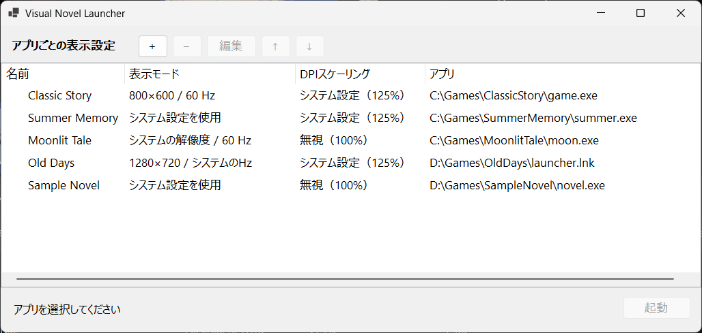

# Visual Novel Launcher

ビジュアルノベルごとに解像度とリフレッシュレートを切り替えて起動する、Windows向けポータブルランチャーです。

高リフレッシュレート環境で古いゲームのアニメーション速度が変わる場合や、ゲームごとに表示設定を切り替えたい場合に利用できます。ゲーム終了後は、起動前の表示モードへ自動的に戻します。

<p align="center">
  
</p>

## 主な機能

- アプリごとに解像度、リフレッシュレート、起動引数を保存
- 表示設定を変更せず、実行ファイル管理専用のランチャーとしても利用可能
- `+`ボタンまたはEXEのドラッグ＆ドロップで登録
- EXEのアイコンと、拡張子を除いたファイル名を自動取得
- 一覧のダブルクリックまたは起動ボタンで実行
- アプリ終了後に元の表示モードへ自動復帰
- ポータブル運用：設定は実行ファイルと同じ場所の`profiles.json`へ保存
- レジストリ不使用

## 動作環境

- Windows 10 / 11 x64
- .NET 8 Desktop Runtime

## 使い方

1. [Releases](https://github.com/ryry23/VisualNovelLauncher/releases)から最新版ZIPをダウンロードします。
2. ZIPを任意のフォルダへ展開します。
3. `VisualNovelLauncher.exe`を起動します。
4. `+`ボタン、またはEXEのドラッグ＆ドロップでゲームを登録します。
5. 必要に応じて解像度とリフレッシュレートを設定して保存します。両方の変更をオフにすると、表示設定を維持したまま起動します。
6. 一覧からゲームを選び、`起動`を押します。

マルチモニター環境では「解像度も変更する」をオフにし、リフレッシュレートだけ変更する設定を推奨します。デスクトップ解像度を変更すると、Windowsが他のディスプレイの配置を調整する場合があります。

## アップデート方法

登録したアプリと設定は、`VisualNovelLauncher.exe`と同じフォルダの`profiles.json`に保存されています。

- 新しいバージョンを同じフォルダへ上書き展開する場合、`profiles.json`はそのまま利用できます。
- 新しいバージョンを別のフォルダへ展開する場合、旧フォルダの`profiles.json`を新しいフォルダへコピーしてください。
- 念のため、アップデート前に`profiles.json`をバックアップすることを推奨します。

`profiles.json`にはアプリの絶対パスが保存されるため、ゲーム本体を移動した場合は登録内容の編集が必要です。

## ビルド

開発用（.NET 8 SDKを利用）：

```powershell
dotnet build VisualNovelLauncher.csproj -c Release
```

軽量版（Github Releaseではこれを利用・利用環境に.NET 8が必要）：

```powershell
dotnet publish VisualNovelLauncher.csproj -c Release -r win-x64 --self-contained false -o publish
```

スタンドアロン版（.NET 8を同梱）：

```powershell
dotnet publish VisualNovelLauncher.csproj -c Release -r win-x64 --self-contained true -p:PublishSingleFile=true -o publish
```

## 注意事項

- 本ツールはゲーム本体、認証機能、DRMを変更しません。
- 未保存の作業がある状態での使用には注意してください。
- 異常終了やOSの強制終了時には表示モードを復帰できない場合があります。
- 本ソフトウェアは無保証で提供されます。

## ライセンス

[MIT License](LICENSE)
